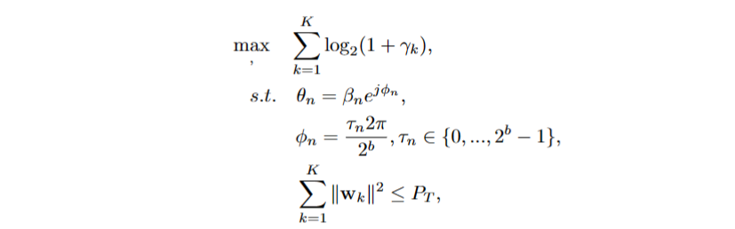
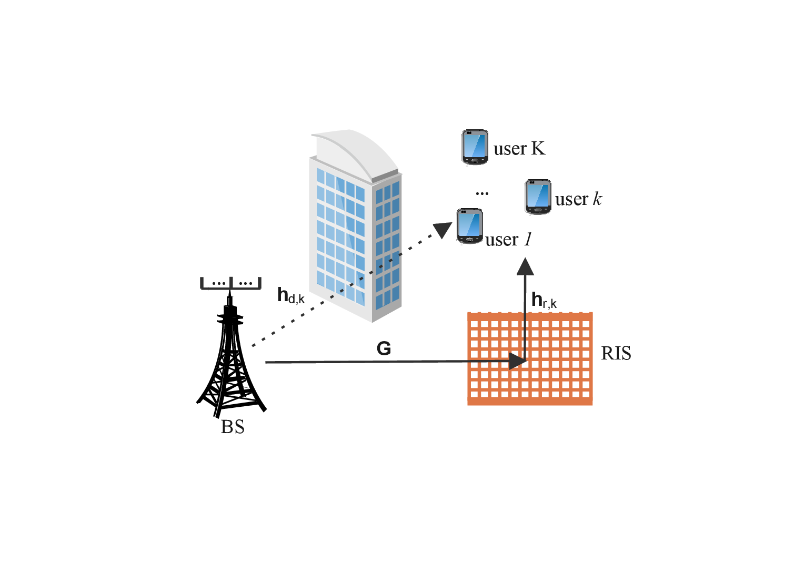

# 4.1 Problem Description

Reconfigurable intelligent surface (RIS) is an emerging technology to achieve cost-effective communications [[MJ19]](../References/ref.html#MJ19)[[YLJ+21]](../References/ref.html#YLJ+21). It is a planar passive radio structure with a number of reconfigurable passive elements. Each element can independently adjust the phase shift on the incident signal. Consequently, these elements collaboratively yield a directional beam to enhance the quality of the received signal. The active beamforming at the base station (BS) and RIS should be jointly considered to customize the propagation environment.

The targeted problem considers a RIS-aided downlink multi-user multiple-input single-output (MU-MISO) system, in which a BS equipped with multiple antennas transmits signals to $K$ single-antenna users, as shown in [Figure 6](#Fig6). Decision variables of the problem are continual active beamforming of BS and discrete phase shifts of RIS. The objective is to maximize the sum rate of all users, subjecting to the transmit power constraint. The problem is formulated as [[YZL+22]](../References/ref.html#YZL+22):

where = [1, ...,K ] ∈M ×K is the active beamforming at BS; = diag(θ1, ..., θn, ..., θN ) is the diagonal
phase-shift matrix of RIS; γ is the signal-to-interference-plus-noise ratio of user k; βn and φn stand
for the reflection coefficients and phase shift of element n, respectively; and (3d) indicates that the transmit power is not larger than PT.

Figure 6: A downlink MU-MISO system with an RIS.

 

This problem is a non-convex mixed integer problem, which is generally NP-hard. Furthermore,
the fitness landscape analysis in [[YZL+22]](../References/ref.html#YZL+22) revealed that the problem has a severe unstructured and rugged
landscape, especially in cases with a large-sized RIS. While water-filling solutions [[YRBC04]](../References/ref.html#YRBC04) can settle BS
beamforming, the discrete phase shifts of RIS are non-trivial because the reconfigurable passive elements couple with each other. Existing solvers that decouple the elements and estimate each phase
shift separately have been demonstrated to be ineligible [[YZL+22]](../References/ref.html#YZL+22). Metaheuristics’ global search ability is
promising in handling such unstructured, rugged and highly-coupled problem. AutoOptLib could benefit the problem researchers to quickly get access to an efficient metaheuristic solver from the variety
of choices.
