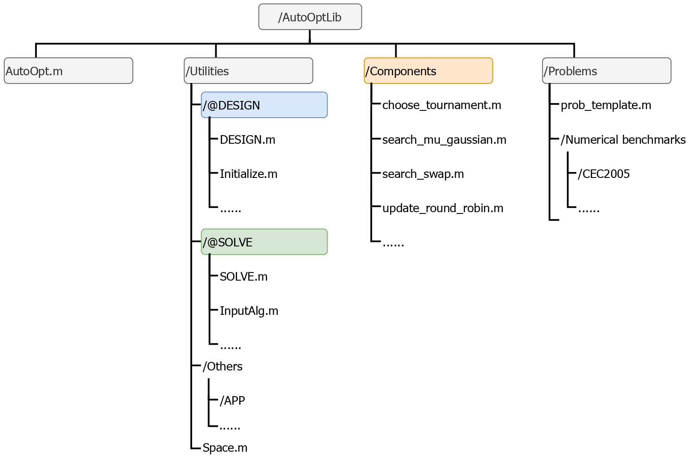
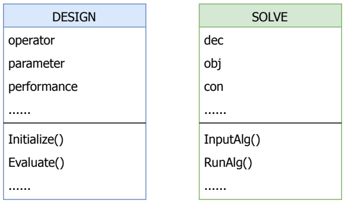
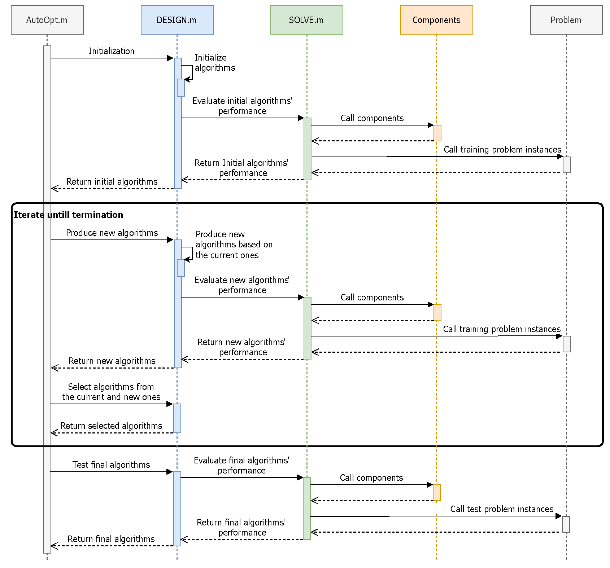

# 2.2 AutoOptLib Architecture

## 2.2.1 File Structure

The file structure of AutoOptLib is given in [Figure 2](#Figure2). As shown in [Figure 2](#Figure2), source files of the library
are organized in a clear and concise structure. One interface function AutoOpt.m and three folders
are in the root directory. The folder /Utilities contains public classes and functions. Specifically, the
subfolder /@DESIGN stores the class and functions for designing algorithms for a target problem,
including functions for initializing, searching, and evaluating algorithms. /@SOLVE contains the
class and functions for solving the target problem by the designed algorithms, e.g., functions for
inputting algorithms, executing the algorithms, and repairing solutions. /Others involves miscellaneous
functions, e.g., sources of the GUI, functions of experimental tools, etc. The Space.m function is for
constructing the design space by algorithmic components.

The /Components folder contains the algorithmic components for constructing the design space.
We package each component with ranges of its endogenous parameter values in a single .m file. For
example, in [Figure 2](#Figure2), choose tournament.m and search mu gaussian.m are the functions of the tournament selection [[ES+03]](../References/ref.html#ES+03) and Gaussian mutation [[Fog98]](../References/ref.html#Fog98), respectively. All the component functions are
written in the same structure, so users can easily implement and add new components to the library
according to existing ones.

Finally, the /Problems folder is for the target problems. A problem template, i.e., the prob template.m
in [Figure 2](#Figure2), is given to guide users to easily implement and interface their problems with the library.
Some widely-used numerical benchmark problems, e.g., the CEC2005 single-objective real-parameter
optimization problems [SHL+05](../References/ref.html#SHL+05) , are also provided for toy experimentation.

Figure 2: File structure of AutoOptLib.

 

## 2.2.2  Classes

We involve only two classes in AutoOptLib, namely **DESIGN** and **SOLVE**, which manage the process of
designing algorithms for a target problem and solving the target problem by the designed algorithms,
respectively. The class diagram is given in [Figure 3](#Figure3). An object of the **DESIGN** class is a designed algorithm with several properties, e.g., **operator** (components that constitute the algorithm), **parameter**
(endogenous parameters of the algorithm), and **performance** (performance of the algorithm). The
class have some methods to be invoked by the objects. For example, the method **Initialize()** works
on initializing the designed algorithms; **Evaluate()** is for evaluating the algorithms’ performance
according to a design objective.

An object of the **SOLVE** class is a solution to the target problem. It has several properties, including
**dec** (decision variables), **obj** (objective value), **con** (constraint violation), etc. The class has several
methods for achieving the solutions, such as **InputAlg()** (preprocessing and inputting the designed
algorithm) and **RunAlg()** (running the algorithm on the target problem).

  

 

Figure 3: Class diagram of AutoOptLib.

 

## 2.2.3 Operating Sequence

AutoOptLib’s sequence diagram is depicted in [Figure 4](#Figure4). To begin with, the interface function AutoOpt.m invokes DESIGN.m to instantiate objects (the designed algorithms) of the DESIGN class.
In detail, firstly, DESIGN.m uses the Initialize() method to initialize algorithms over the design
space. Then, the algorithms’ performance on solving the “training” instances [1](#note1) of the target problem
is evaluated by the Evaluate() method. To get the performance, the Evaluate() method invokes
the SOLVE class, and SOLVE further calls functions of the algorithms’ components and function of the
target problem. Finally, the initial algorithms are returned to AutoOpt.m.

Figure 4: Sequence diagram of AutoOptLib.

 
 

-------
1. Since the distribution of instances of a real problem is often unknown, one has to sample some of the problem
instances and target these instances (training instances) during the algorithm design procedure. To avoid the designed
algorithms overfit on the training instances, some other instances (test instances) of the target problem are then employed
to test the final algorithms after the design procedure terminates.