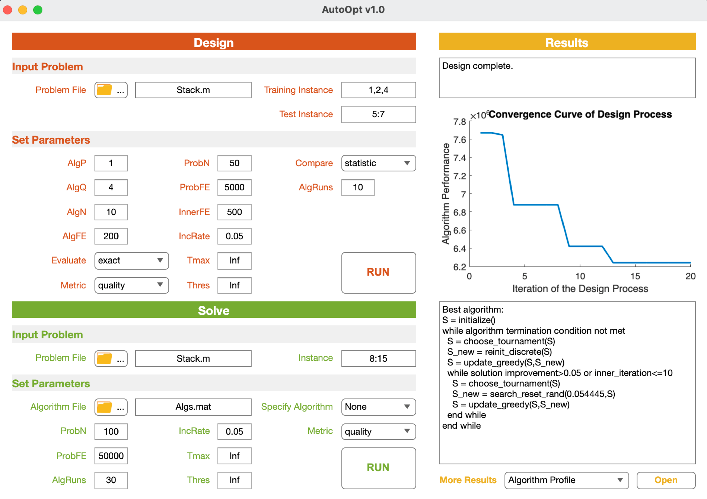

# 2.3 Use AutoOptLib

Following the three steps below to use AutoOptLib:

## 2.3.1 Step 1: Implement Problem

AutoOptLib supports implementing the target problem in Matlab or Python. More formats will be supported in future versions.

**Implement in Matlab:**

Users can implement their target optimization problem according to the template `prob_template.m`
in the `/Problems` folder. `prob_template.m` has three main cases. `Case ‘construct’` is for setting
problem properties and loading the input data. In particular, line 7 defines the problem type, e.g.,
`Problem.type = {‘continuous’,‘static’,‘certain’}` refers to a continuous static problem without uncertainty in the objective function. Lines 10 and 11 define the lower and upper bounds of the
solution space. Lines 18 and 21 offer specific settings as indicated in the comments of lines 14-17 and
20, respectively. Line 25 or 26 is for loading the input data. As a result, problem proprieties and data
are saved in the `Problem` and `Data` structs, respectively.

```matlab
 case 'construct' % define problem properties
    Problem = varargin{1};
    % define problem type in the following three cells.
    % first cell : 'continuous'\'discrete'\'permutation'
    % second cell: 'static'\'sequential'
    % third cell : 'certain'\'uncertain'
    Problem.type = {'','',''}; 
        
    % define the bound of solution space
    lower = []; % 1*D, lower bound of the D-dimension decision space
    upper = []; % 1*D, upper bound of the D-dimension decision space
    Problem.bound = [lower;upper];        
        
    % define specific settings (optional), options: 
    % 'dec_diff'         : elements of the solution should be different w.r.t each other for discrete problems
    % 'uncertain_average': averaging the fitness over multiple fitness evaluations for uncertain problems
    % 'uncertain_worst'  : use the worse fitness among multiple fitness evaluations as the fitness for uncertain problems
    Problem.setting = {''}; % put choice(s) into the cell        
        
    % set the number of samples for uncertain problems (optional)
    Problem.sampleN = [];              
    output1 = Problem;
        
    % load/construct data file in the following
    Data = load(''); % for .mat format
    % Data = readmatrix('','Sheet',1); % for .xlsx format
    output2 = Data;
```


`Case ‘repair’` is for repairing solutions to keep them feasible, e.g., keeping the solutions within
the box constraint. Lines 2 and 3 input the problem data and solutions (decision variables). Programs
for repairing solutions should be written from line 5. Finally, the repaired solutions will be returned.
```matlab
case 'repair' % repair solutions
    Data = varargin{1};
    Decs = varargin{2};
    % define methods for repairing solutions in the following
       
    output1 = Decs;
```


`Case ‘evaluate’` is for evaluating solutions’ fitness (objective values penalized by constraint violations). In detail, lines 2 and 3 input the problem data and solutions. The target problem’s objective
function should be written from line 6. Constraint functions (if any) should be written from line 8. For the constrained problems, AutoOptLib follows the common practice of the metaheuristic community, i.e., using constraint violations as penalties to discount infeasible solutions. Constraint violation can be calculated in line 10 by [[JD13]](../References/ref.html#JD13):

<a name="Equation3"></a>


where **_CV_(x)** is the constraint violation of solution **x**; **_ḡ<sub>j</sub>_(x)** and **_h̄<sub>k</sub>_(x)** are the _j_ th normalized inequality constraint and _k_ th normalized equality constraint, respectively, in which the normalization can be done
by dividing the constraint functions by the constant in this constraint present (i.e., for **_g<sub>j</sub>_(x)** ≥ **_b<sub>j</sub>_**, the
normalized constraint function becomes **_ḡ<sub>j</sub>_(x)** = **_g<sub>j</sub>_(x)** / **_b<sub>j</sub>_** ≥ 0,
and similarly **_h̄<sub>k</sub>_(x)** can be normalized equality constraint); the bracket operator
⟨**_ḡ<sub>j</sub>_(x)**⟩ returns the negative of **_ḡ<sub>j</sub>_(x)**, if **_ḡ<sub>j</sub>_(x)** < 0 and returns zeros, otherwise. 
During solution evaluation, accessory (intermediate) data for understanding
the solutions may be produced. This can be written from line 12. Finally, the objective values,
constraint violations, and accessory data will be returned by lines 13-15.

```matlab
case 'evaluate' % evaluate solution's fitness
    Data = varargin{1}; % load problem data
    Decs = varargin{2}; % load the current solution(s)
        
    % define the objective function in the following
        
    % define the inequal constraint(s) in the following, equal constraints should be transformed to inequal ones
       
    % calculate the constraint violation in the following

    % collect accessory data for understanding the solutions in the following (optional)

    output1 = ; % matrix for saving objective function values
    output2 = ; % matrix for saving constraint violation values (optional)
    output3 = ; % matrix or cells for saving accessory data (optional), a solution's accessory data should be saved in a row

```

Examples of problem implementation can be seen in the `/Problems/CEC2005 Benchmarks` folder. The implementation of a real constrained problem 
`beamforming.m` is given in the `/Problems/Real-World/Beanforming` folder.

**Implement in Python:**

AutoOptLib provides a Python interface `prob.py` in the `Problems` folder to input the target problem from Python files. It contains three methods. The first method `get_type` is for users defining their problems' type (line 5). The second method `get_bound` is for users defining the solution space boundary of their target problem (lines 13 and 14). In the third method `evaluate`, the input `Decs` is the solutions fetched from Matlab. Users should define the function for evaluating the solutions as `your_evaluate_method` (line 23). The function should have three output variables `obj`, `con`, and `acc` that contain the solutions' objective values, constraint violation values, and accessory data, respectively. `con`, and `acc` can be replaced  with `_` if not applicable. Returns of the interface `prob.py` will be fetched to the Matlab problem file `prob_from_py.m`, which will be invoked during algorithm design. 

```python
def get_type():
    # get problem type
    # return type = ['continuous'/'discrete'/'permutation', 'static'/'sequential', 'certain'/'uncertain']
    # e.g.,
    type = ['continuous', 'static', 'certain']  # a static, continuous problem without uncertainty
    return type

def get_bound():
    # get solution space boundary
    # shape: [1, D], where D is the dimensionality of solution space, type: 'list'
    # e.g.,
    lower = [0, 0, 0, 0, 0]
    upper = [1, 1, 1, 1, 1]  # a 5D solution space
    return lower, upper

def evaluate(Decs, instanceInd):
    # evaluate solutions
    # 'Decs' is the solutions fetched from Matlab, shape: [N, D], where N and D are the number of solutions and the dimensionality of a solution, respectively.
    # 'instanceInd' is the index of problem instance

    obj, con, acc = your_evaluate_method(Decs, instanceInd)
    # your_evaluate_method contains your code for evaluating solutions on the current problem instance
    # 'obj': solutions' objective values, shape: [N, 1] for single-objective optimization, type: 'list'
    # 'con': solutions' constraint violation values, shape: [N, 1], type: 'list'
    # 'acc': accessory data, shape: [N, P], one row for one solution' accessory data, type: 'list'
    # replace 'con' and 'acc' with '_' if not applicable
    return obj, con, acc
```

## 2.3.2 Step 2: Define Design Space
AutoOptLib provides over 40 widely-used algorithmic components for designing algorithms for continuous, discrete, and permutation problems. Each component is packaged in an independent .m file in the `/Components` folder. The included components are listed in [Table 1](../GettingStart/Introduction.html#table1).

The default design space for each type of problems covers all the involved components for this type.
Users can either employ the default space or define a narrow space in `Space.m` in the `/Utilities` folder according to interest. For example, when designing algorithms for continuous problems, the candidate Search components can be set by collecting the
string of component file name in line 3. More components can be added, which will be detailed in
Section [3.1](../DeveloperGuide/Extend_AutoOptLib.html#extend-autooptlib).

<a name="listing1"></a>
<div style="text-align: center;">Code Listing 1: Design space</div>

```matlab
case 'continuous'
    Choose = {'choose_traverse';'choose_tournament';'choose_roulette_wheel';'choose_brainstorm';'choose_nich'}; 
    Search = {'search_pso';'search_de_current';'search_de_current_best';'search_de_random';'cross_arithmetic';'cross_sim_binary';'cross_point_one';'cross_point_two';'cross_point_uniform';'search_mu_gaussian';'search_mu_cauchy';'search_mu_polynomial';'search_mu_uniform';'search_eda';'search_cma';'reinit_continuous'};
    Update = {'update_greedy';'update_round_robin';'update_pairwise';'update_always';'update_simulated_annealing'};
       
case 'discrete'
    Choose = {'choose_traverse';'choose_tournament';'choose_roulette_wheel';'choose_nich'};
    Search = {'cross_point_one';'cross_point_two';'cross_point_uniform';'search_reset_one';'search_reset_rand';'reinit_discrete'};
    Update = {'update_greedy';'update_round_robin';'update_pairwise';'update_always';'update_simulated_annealing'};

case 'permutation'
    Choose = {'choose_traverse';'choose_tournament';'choose_roulette_wheel';'choose_nich'};
    Search = {'cross_order_two';'cross_order_n';'search_swap';'search_swap_multi';'search_scramble';'search_insert';'reinit_permutation'};
    Update = {'update_greedy';'update_round_robin';'update_pairwise';'update_always';'update_simulated_annealing'};
```


## 2.3.3 Step 3: Run AutoOptLib
Users can run AutoOptLib either by Matlab command or GUI.

**Run by Command:**

Users can run AutoOptLib by typing the following command in MATLAB/Octave command window (For Octave, three packages should be loaded via `pkg load communications`, `pkg load statistics`, and `pkg load io` before executing the command):

<div style="text-align: center; font-weight: bold;">AutoOpt(‘name1’,value1,‘name2’,value2,...),</div>
<br>

where `name` and `value` refer to the input parameter’s name and value, respectively. The parameters
are introduced in [Table 4](#table4). In particular, parameters `Metric` and `Evaluate` define the design objective
and algorithm performance evaluation method, respectively. They are summarized in [Table 2](../GettingStart/Introduction.html#table2) and [Table 3](../GettingStart/Introduction.html#table3), respectively.

Parameters `Problem`, `InstanceTrain`, `InstanceTest`, and `Mode` are mandatory to input into the 
command. For other parameters, users can either use their default values without input to the
command or input by themselves for sophisticated functionality. The default parameter values can
be seen in `AutoOpt.m`. As an example, `AutoOpt(‘Mode’, ‘design’, ‘Problem’, ‘CEC2005 f1’,
‘InstanceTrain’, [1,2], ‘InstanceTest’, 3, ‘Metric’, ‘quality’)` is for designing algorithms
with the best solution quality on the CEC2005 f1 problem.

There are also conditional parameters when certain options of the main parameters are chosen.
For example, setting `Metric` to `runtimeFE` incurs conditional parameter `Thres` to define the algorithm
performance threshold for counting the runtime. All conditional parameters have default values and
are unnecessary to set in the command.

After AutoOptLib running terminates, results will be saved as follows:

+ If running the `design` mode,
  1. The designed algorithms’ graph representations, phenotypes, parameter values, and performance will be saved as `.mat` table in the root dictionary.
Algorithms in the `.mat` table can later be called by the `solve` mode to apply to solve the target problem or make experimental comparisons with other algorithms.
  2. A report of the designed algorithms’ pseudocode and performance will be saved as `.csv` table. Users can read, analyze, and compare the algorithms through the report.
  3. The convergence curve of the design process (algorithms’ performance versus the iteration of design) will be depicted and saved as `.fig` figure.
Users can visually analyze the design process and compare different design techniques through the figure.

+ If running the `solve` mode,
  1. Solutions to the target problem will be saved as `.mat` table and `.csv` table.
  2. Convergence curves of the problem-solving process (solution quality versus algorithm execution) will be plotted in `.fig` figure.

<br>

**Run by GUI:**


<div style="text-align: center;">Figure 5: GUI of AutoOptLib.</div>
<br>

The GUI can be invoked by the command `AutoOpt()` without inputting parameters. It is shown in [Figure 5](#Figure5). The GUI has three panels, i.e., Design, Solve, and Results:

+ The Design panel is for designing algorithms for a target problem. It has two subpanels, i.e., Input Problem and Set Parameters:
  - Users should load the function of their target problem and set the indexes of training and test instances in the Input Problem subpanel.
  - Users can set the main and conditional parameters related to the design in the Set Parameters subpanel. All parameters have default values for non-expert users’ convenience. The objective of design, the method for comparing the designed algorithms, and the method for evaluating the algorithms can be chosen by the pop-up menus of the Metric, Compare, and Evaluate fields, respectively.

  After setting the problem and parameters, users can start the run by clicking the RUN bottom.

+ When the running starts, warnings and corresponding solutions to incorrect uses (if any) will be displayed in the text area at the top of the Results panel. The real-time stage and progress of
the run will also be shown in the area. After the run terminates, results will be saved in the same format as done by running by commands. Results will also be displayed on the GUI as follows:
  - The convergence curve of the design process will be plotted in the axes area of the Results panel.
  - The pseudocode of the best algorithm found during the run will be written in the text area below the axes, as shown in Figure 5.
  - Users can use the pop-up menu at the bottom of the Results panel to export more results, e.g., other algorithms found during the run, and detailed performance of the algorithms on different problem instances.
 
+ The Solve panel is for solving the target problem by an algorithm. It follows a similar scheme to the Design panel. In particular, users can load an algorithm designed by AutoOptLib in
the Algorithm File field to solve the target problem. Alternatively, users can choose a classic algorithm as a comparison baseline through the pop-up menu of the Specify Algorithm field.
AutoOptLib now provides 17 classic metaheuristic algorithms in the menu. After the problemsolving terminates, the convergence curve and best solutions will be displayed in the axes and
table areas of the Results panel, respectively; detailed results can be exported by the pop-up menu at the bottom.

<br>

<a name="table4"></a>
<div style="text-align: center;">Table 4: Parameters in the commands for running AutoOptLib.</div>

| Parameter                                        | Type | Description                                                                                                                                              |
|--------------------------------------------------|-----|----------------------------------------------------------------------------------------------------------------------------------------------------------|
| **Parameters related to the target problem**       |  -  | -                                                                                                                                                        |
| Problem                                          | character string  | Function of the target problem                                                                                                                           |
| InstanceTrain                                    | positive integer  | Indexes of training instances of the target problem                                                                                                      |
| InstanceTest                                     | positive integer  | Indexes of test instances of the target problem                                                                                                          |
| **Parameters related to the designed algorithms**    |  -  | -                                                                                                                                                        |
| Mode                                             | character string  | Run mode. Options: design - design algorithms for the target problem, solve - solve the target problem by a designed algorithm or an existing algorithm. |
| AlgP                                             | positive integer  | Number of search pathways in a designed algorithm                                                                                                        |
| AlgQ                                             | positive integer  | Maximum number of search operators in a search pathway                                                                                                   |
| Archive                                          | character string  | Name of the archive(s) that will be used in the designed algorithms                                                                                      |
| LSRange                                          | $[0,1]$ real number | Range of inner parameter values that make the component perform local search <sup>[1](#note1)</sup>.                                                                        |
| IncRate                                          | $[0,1]$ real number | Minimum rate of solutions' fitness improvement during 3 consecutive iterations                                                                           |
| InnerFE                                          | positive integer  | Maximum number of function evaluations for each call of local search                                                                                     |
| **Parameters controlling the design process**        |  -  | -                                                                                                                                                        |
| AlgN                                             | positive integer  | Number of algorithms to be designed                                                                                                                      |
| AlgRuns                                          | positive integer  | Number of algorithm runs on each problem instance                                                                                                        |
| ProbN                                            | positive integer  | Population size of the designed algorithms on the target problem instances                                                                               |
| ProbFE                                           | positive integer  | Number of fitness evaluations of the designed algorithms on the target problem instances                                                                 |
| Metric                                           | character string  | Metric for evaluating algorithms' performance (the objective of design). Options: quality, runtimeFE, runtimeSec, auc.                                   |
| Evaluate                                         | character string  | Method for evaluating algorithms' performance. Options: exact, intensification, racing, surrogate.                                                       |
| Compare                                          | character string  | Method for comparing the performance of algorithms. Options: average, statistic                                                                          |
| AlgFE                                            | positive integer  | Maximum number of algorithm evaluations during the design process (termination condition of the design process)                                          |
| Tmax                                             | positive integer  | Maximum running time measured by the number of function evaluations or wall clock time                                                                   |
| Thres                                            | real number       | The lowest acceptable performance of the designed algorithms. The performance can be solution quality.                                                   |
| RacingK                                          | positive integer  | Number of instances evaluated before the first round of racing                                                                                           |
| Surro                                            | real number       | Number of exact performance evaluations when using surrogate                                                                                             |
| **Parameters related to solving the target problem** |  -  | -                                                                                                                                                        |
| Alg                                              | character string  | Algorithm file name, e.g., Algs                                                                                                                          |

<a id="note1"></a>1. Some search operators have inner parameters to control performing global or local search. For example, a large mutation probability of the uniform mutation operator indicates a global search, while a small probability indicates a local search over neighborhood region. As an example, in cases with `LSRange=0.2`, the uniform mutation with probability lower than `0.2` is regarded as performing local search, and the probability equals or higher than `0.2` performs global search.


