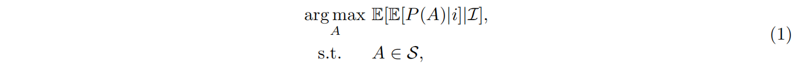
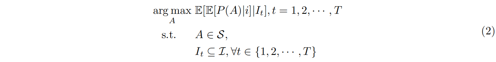
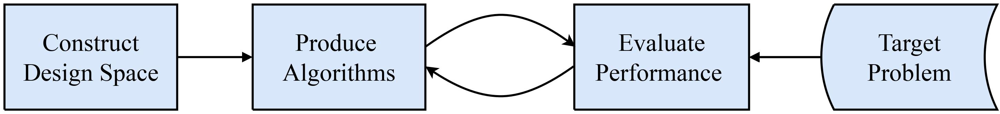

# 2.1 What is automated algorithm design?

Given a target problem, through algorithm design, we would like to find an algorithm(s) with the best performance on the problem [[BK09]](../References/ref.html#BK09):

where _A_ is the designed algorithm; _S_ is the design space, from where _A_ can be instantiated; 
_i_ ∈ _**I**_ is an instance of the target problem domain _**I**_; _P_ : _S_ × _**I**_ → _R_ is a performance metric that measures the performance of _A_ in _I_. 
The design aims to find algorithm(s) with the maximum expected performance in _**I**_.

In reality, the distribution of problem instances in _**I**_ is often unknown, 
and one cannot exhaust all the instances during the design process. The common practice of 
settling for the reality is to consider a finite set of instances from _**I**_. Consequently, Eq. ([1](#Equation1)) can be reformulated as

where _**I**t_ is the finite set of instances that are target at time (i.e., iteration<a href="#footnote1">1</a>) t of the design process.
The target problem instances can either be fixed (i.e., _**I**1_ = _**I**2_ = · · · = _**I**T_ ) or dynamically changed during the design process.
The output of solving Eq. ([2](#Equation2)) is algorithm(s) with the best performance on the considered instances.
To avoid the designed algorithms overfitting, the design process can be followed by validation 
to investigate the generalization of the designed algorithms to instances from _**I**\{ **I**1_, _**I**2_, · · · , _**I**t_ }.

Figure 1: Process of automated design of metaheuristic optimizers.

 

The general process of automated design of metaheuristic optimizers can be abstracted into four
parts, as shown in [Figure. 1](#Fig1). First, the design space collects of candidate primitives or components
for instantiating metaheuristic algorithms. It regulates what algorithms can be found in principle.
Second, the design strategy provides a principle way to design algorithms by selecting and combining
the primitives or components from the design space. Third, the performance evaluation strategy defines
how to measure the performance of the designed algorithms. The measured performance guides the
design strategy to find desired algorithms. Finally, because the design aims to find algorithms with
promising performance on solving a target problem, the target problem acts as external data to support
the performance evaluation. 

 
 

------

  
1. Since Equation 2 is a black-box problem, it is often solved in an iterative manner.

